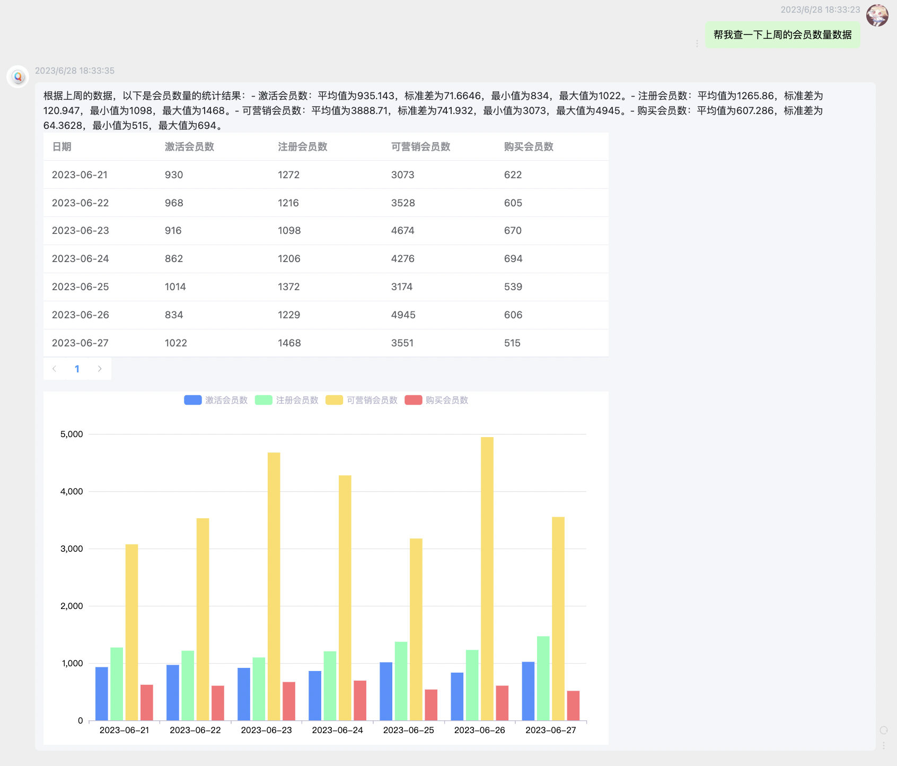

<h1 align="center">
   QueryGPT
</h1>
<div align="center">

  [](https://www.apache.org/licenses/LICENSE-2.0.html)
  [](https://github.com/sdaaron/QueryGPT/stargazers)
  [](https://github.com/sdaaron/QueryGPT/fork)
  [](https://github.com/sdaaron/QueryGPT/graphs/contributors)
</div>

## QueryGPT Natural Language Data Query

> 1. QueryGPT is a natural language data query tool based on `OpenAI GPT3.5` and `Langchain`.
> 2. It is implemented using `OpenAI GPT3.5-turbo-0613` and `Langchain Function Agent`, which is faster, more stable, and more accurate than `Pandas Agent` and `CSV Agent`.
> 3. It supports data output in `Markdown` format, `JSON` format, and visualization with `ECharts` and `Matplotlib`.

## Example

<div align="center">
  
</div>

## Quick Start

### Start API
1. Install `Python 3.10` and `pip`, and create a virtual environment.
2. `git clone git@github.com:sdaaron/QueryGPT.git`
3. `cd QueryGPT/server`
4. `pip install -r requirements.txt`
5. Rename `.env.example` to `.env` and modify the environment variables.
```
OPENAI_API_KEY='Your OpenAI Key'
```
6. Start the API  
Start the API with the default local data file: `python main.py --host xx --port xxx`  
Start the API with a specific local CSV file: `python main.py --host xx --port xxx --csv_path xxx.csv`  
Start the API with a specific local Excel file: `python main.py --host xx --port xxx --excel_path xxx.xlsx`

### Start UI
1. `cd QueryGPT/client`
2. `pnpm install`
3. `npm run dev`
4. Make sure your `vite.config.js` has the same `proxy` configuration as your API service address.

## Project Introduction
1. Project Overview  
   * QueryGPT is a data query tool based on OpenAI. It uses FastAPI as the backend framework and Langchain to implement specific functions. The advantages of this tool include data privacy and validity, as all data operations are performed locally without passing through the interface. Additionally, the tool is extensible, and developers can add custom classes in the Langchain tool to implement specific query functions. Furthermore, the tool uses Embedding similarity search to achieve multi-file search, enabling quick identification of target columns and reducing the token usage.
2. Features and Characteristics  
   * The tool retrieves the required information by calling OpenAI's API, completes the data query by calling the interface, and preprocesses the information to retain only the relevant information, ensuring data privacy and validity.
   * The Langchain tool implements agent functions, and developers can extend the tool's functionality by adding the required classes in the tool to achieve specific query functions.
   * Embedding similarity search is used to quickly identify target columns and reduce the number of tokens. By converting the data into vector representations and calculating the similarity between vectors, target columns similar to the query conditions can be quickly found. Reducing the number of tokens improves search efficiency and performance.

3. Limitations
   * The tool has relatively simple functionality and cannot flexibly implement complex query tasks. It may not meet users' requirements for advanced queries and complex data analysis tasks.
   * Limited usability: The tool is currently only suitable for querying structured data (such as CSV files). It has low applicability to other types of data or different query scenarios and cannot achieve good migration and scalability.

4. Future Development
   To further enhance the functionality and applicability of the tool, the following improvements and developments can be considered:
   * Support more query scenarios: The tool can be extended to support more query scenarios for structured data, such as database queries. This can increase the tool's applicability and meet a wider range of user needs.
   * Implement a universal data repository: To support more query methods and data types, consider implementing a universal data repository. By building a data repository, users can flexibly perform data queries and analysis, and enjoy more features and capabilities.  

## Contact Us
<div align="center">
  
</div>


## Roadmap
- [ ] Implement data query functionality and result output
  - [x] Implement custom Langchain Function Agent
    - [x] Implement Query Tool to achieve basic data retrieval requirements
    - [x] Implement Plot Tool to enable chart generation
    - [ ] Implement various custom calculation tools
      - [x] Calculate average order value, percentage, growth rate
      - [x] Calculate month-over-month and year-over-year growth rate
      - [ ] Support more custom calculations
    - [x] Integrate ydata-profiling for simple data description
  - [x] Embedding similarity search
  - [x] Support multiple output formats
    - [x] Output data in Markdown format
    - [x] Output data in JSON format
    - [x] Use Matplotlib to generate clustered bar charts, line charts, pie charts
    - [x] Output Echarts charts
    - [x] Output tables

- [ ] Optimization of interactivity
  - [x] Improve UI design
  - [x] Optimize chart styles
  - [ ] Streamed output
  - [ ] Guide users to ask questions correctly and display related questions
  - [ ] Display data retrieval process

- [ ] Implement more features
  - [ ] Enhanced data analysis capabilities: Perform simple analysis on output data
  - [ ] Support user-uploadable tabular data
  - [ ] Support database connection
  - [ ] Support natural language operations on tabular data
  - [ ] User login
